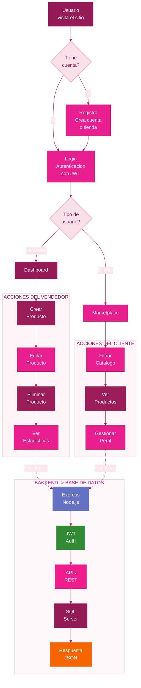

# Diagrama de Flujo

Interaccion completa del sistema Leyka Dessert And More

```mermaid
%%{init: {
  "theme": "base",
  "themeVariables": {
    "background": "#ffffff",
    "primaryColor": "#c2185b",
    "primaryTextColor": "#ffffff",
    "primaryBorderColor": "#c2185b",
    "lineColor": "#c2185b",
    "secondaryColor": "#fce4ec",
    "tertiaryColor": "#f8bbd0",
    "fontFamily": "Georgia, Times New Roman, serif"
  }
}}%%

flowchart TB

  A["Usuario<br/>visita el sitio"] --> B{"Tiene<br/>cuenta?"}
  B -- "No" --> C["Registro<br/>Crea cuenta<br/>o tienda"]
  B -- "Si" --> D["Login<br/>Autenticacion<br/>con JWT"]
  C --> D
  D --> E{"Tipo de<br/>usuario?"}

  E -- "Vendedor" --> F["Dashboard"]
  E -- "Cliente" --> G["Marketplace"]

  subgraph SELLER["ACCIONES DEL VENDEDOR"]
    direction LR
    S1["Crear<br/>Producto"] --> S2["Editar<br/>Producto"]
    S2 --> S3["Eliminar<br/>Producto"]
    S3 --> S4["Ver<br/>Estadisticas"]
  end

  subgraph CLIENT["ACCIONES DEL CLIENTE"]
    direction LR
    C1["Filtrar<br/>Catalogo"] --> C2["Ver<br/>Productos"]
    C2 --> C3["Gestionar<br/>Perfil"]
  end

  subgraph BACK["BACKEND -> BASE DE DATOS"]
    direction LR
    B1["Express<br/>Node.js"] --> B2["JWT<br/>Auth"]
    B2 --> B3["APIs<br/>REST"]
    B3 --> B4["SQL<br/>Server"]
    B4 --> B5["Respuesta<br/>JSON"]
  end

  F --> S1
  G --> C1
  S4 -. Solicitudes .-> B1
  C3 -. Consultas .-> B1

  class A,F seller;
  class C,D,G,S2,S4,C1,C3 accent;
  class B,E decision;
  class S1,S3,C2 dark;
  class B1 backendBlue;
  class B2 backendGreen;
  class B3 backendPink;
  class B4 backendWine;
  class B5 backendOrange;

  classDef seller fill:#971b58,stroke:#971b58,color:#ffffff,stroke-width:2px;
  classDef accent fill:#e91e8f,stroke:#c2185b,color:#ffffff,stroke-width:2px;
  classDef dark fill:#9c1d5a,stroke:#9c1d5a,color:#ffffff,stroke-width:2px;
  classDef decision fill:#f8dfe8,stroke:#f4a8bf,color:#8d1b52,stroke-width:2px;
  classDef backendBlue fill:#6673c5,stroke:#6673c5,color:#ffffff,stroke-width:2px;
  classDef backendGreen fill:#318a34,stroke:#318a34,color:#ffffff,stroke-width:2px;
  classDef backendPink fill:#f11d8d,stroke:#f11d8d,color:#ffffff,stroke-width:2px;
  classDef backendWine fill:#971b58,stroke:#971b58,color:#ffffff,stroke-width:2px;
  classDef backendOrange fill:#f56600,stroke:#f56600,color:#ffffff,stroke-width:2px;

  style SELLER fill:#fff5f8,stroke:#f4d6e1,stroke-width:2px,color:#9c1d5a;
  style CLIENT fill:#fff5f8,stroke:#f4d6e1,stroke-width:2px,color:#9c1d5a;
  style BACK fill:#fff8fb,stroke:#f4d6e1,stroke-width:2px,color:#e91e8f;
```

